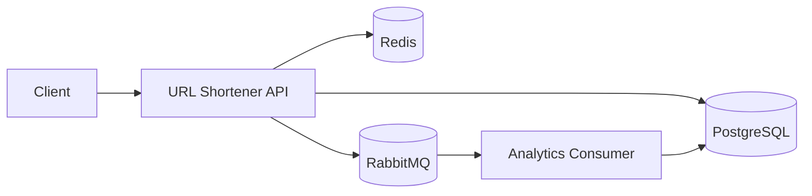

# 🔗 URL Shortener

<p align="center">
  <strong>Scalable URL Shortening Service</strong>
</p>

<p align="center">
  Serviço de encurtamento de URLs desenvolvido com Java e Spring Boot, com foco em performance, caching, processamento assíncrono, resiliência e escalabilidade horizontal.
</p>

<p align="center">
  <a href="https://github.com/alfredobaptista/url-shortener">GitHub Repository</a>
</p>

---

## 📌 Sobre o Projecto

O **URL Shortener** é uma implementação própria de um serviço de encurtamento de URLs, desenvolvida a partir de um desafio/conteúdo de **System Design** sobre a construção de um serviço capaz de lidar com grandes volumes de tráfego.

O projecto foi desenvolvido com foco não apenas na funcionalidade de encurtamento, mas principalmente nos problemas de engenharia envolvidos num sistema deste tipo:

* Performance e baixa latência
* Caching
* Rate limiting
* Concorrência
* Processamento assíncrono
* Persistência
* Analytics
* Resiliência
* Expiração de URLs
* Escalabilidade horizontal

A implementação utiliza **Clean Architecture / Ports & Adapters**, mantendo a lógica de negócio desacoplada dos mecanismos de persistência, cache, mensageria e infraestrutura.

---

## 🏗️ Arquitectura



A aplicação separa o caminho crítico do redireccionamento do processamento assíncrono das analytics.

### Fluxo de criação

```text
Client
  │
  ▼
POST /api/v1/urls
  │
  ▼
Rate Limiting
  │
  ▼
Validate URL
  │
  ▼
Generate Base62 Code
  │
  ▼
Persist PostgreSQL
  │
  ▼
Cache Redis
  │
  ▼
Return Short Code
```

### Fluxo de redireccionamento

```text
Client
  │
  ▼
GET /{shortCode}
  │
  ▼
Redis Cache
  │
  ├── HIT ─────────────────┐
  │                        │
  └── MISS                 │
       │                   │
       ▼                   │
   PostgreSQL              │
       │                   │
       ▼                   │
   Check Expiration        │
       │                   │
       ▼                   │
   Cache Redis             │
       │                   │
       └───────────────────┘
                │
                ▼
        Publish Analytics
                │
                ▼
          RabbitMQ
                │
                ▼
       Analytics Consumer
                │
                ▼
          PostgreSQL
```

O processamento das analytics ocorre fora do caminho crítico da resposta HTTP.

Se a publicação do evento de analytics falhar, o redireccionamento continua normalmente.

---

# 🎯 Principais Decisões Técnicas

## Redis — Cache-Aside

O Redis é utilizado como camada de cache para reduzir consultas ao PostgreSQL durante os redireccionamentos.

```text
Request
   │
   ▼
Redis
   │
   ├── HIT  → Return URL
   │
   └── MISS
        │
        ▼
    PostgreSQL
        │
        ▼
    Redis + Return
```

O TTL do cache é calculado de acordo com a validade da URL.

Para URLs sem data de expiração, é utilizado um TTL configurado pela aplicação.

---

## Redis + Lua — Rate Limiting

O controlo de abuso utiliza Redis com um script Lua para realizar as operações de incremento e expiração de forma atómica.

Configuração actual:

```text
10 requests / minuto / client
```

Quando o limite é excedido, a API retorna:

```http
429 Too Many Requests
```

A utilização de Lua permite executar as operações necessárias de forma atómica, reduzindo condições de corrida entre múltiplas operações Redis.

---

## RabbitMQ — Processamento Assíncrono

Os eventos de acesso às URLs não são persistidos directamente durante o processamento do redirect.

O fluxo principal é:

```text
HTTP Request
     │
     ▼
Redirect
     │
     ▼
Publish Event
     │
     ▼
Return 302
```

O processamento das analytics ocorre posteriormente:

```text
RabbitMQ
    │
    ▼
Analytics Consumer
    │
    ▼
RegisterRedirectAnalyticsUseCase
    │
    ▼
PostgreSQL
```

Esta abordagem reduz o trabalho realizado no caminho crítico do redireccionamento e desacopla o processamento das métricas da resposta HTTP.

---

## Base62

Os códigos das URLs são gerados utilizando caracteres alfanuméricos:

```text
a-z
A-Z
0-9
```

A configuração actual utiliza códigos de **6 caracteres**.

Exemplo:

```text
bbVAZ9
```

A geração utiliza `SecureRandom`.

O espaço de combinações para códigos de 6 caracteres é:

```text
62⁶ = 56.800.235.584
```

A persistência possui uma restrição `UNIQUE` sobre o short code para proteger a integridade dos dados.

---

## Expiração de URLs

Uma URL pode possuir uma data de expiração:

```json
{
  "originalUrl": "https://www.example.com",
  "expiresAt": "2026-10-05T19:30:00"
}
```

Quando a URL expira, o domínio identifica a URL como expirada e a aplicação retorna:

```http
410 Gone
```

Exemplo:

```json
{
  "status": 410,
  "error": "Gone",
  "message": "Esta URL curta expirou."
}
```

O TTL do Redis também é calculado de acordo com a data de expiração.

Desta forma, uma entrada expirada não deve permanecer indefinidamente no cache.

---

# 🧱 Arquitectura de Código

O projecto utiliza **Clean Architecture / Ports & Adapters**.

```text
src/main/java/com/github/alfredobaptista/

├── adapter
│   ├── in
│   │   ├── handler
│   │   ├── messaging
│   │   └── web
│   │       └── dto
│   │
│   └── out
│       ├── cache
│       ├── generator
│       ├── messaging
│       ├── persistence
│       │   ├── adapter
│       │   ├── entity
│       │   └── repository
│       └── security
│
├── application
│   ├── dto
│   ├── exception
│   ├── port
│   │   ├── in
│   │   └── out
│   └── service
│
├── config
│
├── domain
│   ├── exception
│   ├── model
│   └── valueobject
│
└── UrlShortenerApplication.java
```

### Separação de responsabilidades

```text
Domain
  │
  │ Regras de negócio
  ▼
Application
  │
  │ Casos de uso / Ports
  ▼
Adapters
  │
  ├── REST
  ├── PostgreSQL
  ├── Redis
  ├── RabbitMQ
  └── Base62
```

A camada de domínio não depende de Spring, JPA, Redis ou RabbitMQ.

---

# 🔌 API

## Criar URL

```http
POST /api/v1/urls
Content-Type: application/json
```

Request:

```json
{
  "originalUrl": "https://www.example.com"
}
```

Response actual:

```json
{
  "shortCode": "bbVAZ9"
}
```
Com uma data de expiração:

```json
{
  "originalUrl": "https://www.example.com",
  "expiresAt": "2026-10-05T20:00:00"
}
```

### Respostas

```text
201 Created
400 Bad Request
429 Too Many Requests
```

---

## Redireccionar

```http
GET /{shortCode}
```

Resposta:

```http
HTTP/1.1 302 Found
Location: https://www.example.com
```

Possíveis respostas:

```text
302 Found
404 Not Found
410 Gone
```

O cliente HTTP pode seguir automaticamente o `Location`, pelo que ferramentas como Bruno/Postman podem apresentar `200 OK` caso os redirects automáticos estejam activados.

---

## Consultar Analytics

```http
GET /api/v1/urls/{shortCode}/analytics
```

Exemplo:

```json
{
  "shortCode": "bbVAZ9",
  "totalClicks": 2,
  "firstAccessedAt": "2026-09-28T07:47:33.665781",
  "lastAccessedAt": "2026-09-28T07:49:38.640115"
}
```

As métricas são registadas de forma assíncrona através do RabbitMQ.

---

## Eliminar URL

```http
DELETE /api/v1/urls/{shortCode}
```

Resposta:

```http
204 No Content
```

A operação:

1. verifica a existência da URL;
2. remove a URL do PostgreSQL;
3. invalida a entrada correspondente no Redis.

As analytics existentes não dependem de uma foreign key para a tabela `urls`, permitindo preservar o histórico de acessos após a eliminação da URL.

---

# 🧪 Testes

O projecto possui testes unitários utilizando:

* JUnit 5
* Mockito

Execução:

```bash
./mvnw clean test
```

Resultado actual:

```text
36 tests
0 failures
0 errors
```

Principais componentes testados:

* criação de URLs
* redireccionamento
* eliminação
* analytics
* geração de códigos
* value objects
* expiração
* tratamento de falhas no processamento de analytics
* regras de negócio

---

# ⚡ Testes de Carga

Os testes de carga foram realizados com **k6** em ambiente local.

Os resultados abaixo representam o comportamento observado no ambiente de desenvolvimento e **não constituem uma medição de capacidade de produção**.

| VUs | Requests |   Throughput | Failures |      Avg |       p95 |
| --: | -------: | -----------: | -------: | -------: | --------: |
|  10 |  ~48.012 | ~1.600 req/s |       0% |  5.89 ms |  12.61 ms |
|  50 |  ~77.635 | ~2.585 req/s |       0% |    19 ms |  45.71 ms |
| 100 |  ~72.377 | ~2.408 req/s |       0% | 41.18 ms | 117.01 ms |

### Observação

Com o aumento da concorrência, o throughput deixa de crescer de forma linear enquanto a latência aumenta.

Isto evidencia a existência de limites nos recursos disponíveis no ambiente local e demonstra a importância de distribuir a carga entre múltiplas instâncias quando o sistema evolui para um ambiente distribuído.

Os resultados não devem ser interpretados como uma capacidade garantida de produção.

---

# 📈 Escalabilidade

A arquitectura foi concebida para permitir a evolução de uma única instância para múltiplas instâncias da API.

### Arquitectura actual

```text
             ┌──────────────┐
             │    Client    │
             └──────┬───────┘
                    │
                    ▼
             ┌──────────────┐
             │     API      │
             └──────┬───────┘
                    │
        ┌───────────┼───────────┐
        ▼           ▼           ▼
     Redis      PostgreSQL   RabbitMQ
```

### Evolução horizontal

```text
                    Client
                      │
                      ▼
              ┌──────────────┐
              │ Load Balancer│
              └───────┬──────┘
                      │
          ┌───────────┼───────────┐
          ▼           ▼           ▼
       API #1       API #2       API #3
          │           │           │
          └───────────┼───────────┘
                      │
        ┌─────────────┼─────────────┐
        ▼             ▼             ▼
     Redis        PostgreSQL     RabbitMQ
```

Como Redis, PostgreSQL e RabbitMQ são externos às instâncias da API, a camada HTTP pode evoluir para múltiplas instâncias partilhando os mesmos serviços de dados e mensageria.

### Possíveis evoluções

* Load Balancer
* múltiplas instâncias da API
* Redis Cluster
* PostgreSQL com read replicas
* RabbitMQ com múltiplos consumers
* observabilidade distribuída
* métricas e tracing
* políticas de retenção de analytics
* optimização adicional da geração de códigos
* estratégias de retry e dead-letter queues

Estas são **evoluções arquitecturais**, não capacidades que o projecto actualmente reivindica possuir em produção.

---

# 🛠️ Stack Tecnológica

| Categoria       | Tecnologias                           |
| --------------- | ------------------------------------- |
| Linguagem       | Java 21                               |
| Framework       | Spring Boot                           |
| API             | REST                                  |
| Persistência    | PostgreSQL                            |
| Cache           | Redis                                 |
| Mensageria      | RabbitMQ                              |
| Migrações       | Flyway                                |
| Testes          | JUnit 5 · Mockito                     |
| Load Testing    | k6                                    |
| Containerização | Docker · Docker Compose               |
| Arquitectura    | Clean Architecture · Ports & Adapters |
| Build           | Maven                                 |

---

# 🐳 Execução com Docker

## Pré-requisitos

* Docker
* Docker Compose
* Git

Clonar o projecto:

```bash
git clone git@github.com:alfredobaptista/url-shortener.git
cd url-shortener
```

Construir e iniciar os serviços:

```bash
docker compose up --build
```

A stack é composta por:

```text
Spring Boot
PostgreSQL
Redis
RabbitMQ
```

A aplicação ficará disponível em:

```text
http://localhost:8080
```

RabbitMQ Management:

```text
http://localhost:15672
```

Credenciais locais:

```text
username: admin
password: admin123
```

### Serviços Docker

```text
app
 ├── PostgreSQL
 ├── Redis
 └── RabbitMQ
```

O Docker Compose utiliza healthchecks para PostgreSQL, Redis e RabbitMQ antes de iniciar a aplicação.

---

# 💻 Execução Local

Caso pretenda executar a aplicação directamente com Maven:

```bash
./mvnw spring-boot:run
```

O ambiente de desenvolvimento utiliza:

```text
PostgreSQL
localhost:5432

Redis
localhost:6379

RabbitMQ
localhost:5672
```

As migrações da base de dados são executadas através do **Flyway**.

---

# 🗄️ Serviços

## PostgreSQL

Responsável pela persistência de:

* URLs
* analytics
* timestamps
* estado persistente da aplicação

## Redis

Responsável por:

* cache das URLs
* rate limiting
* dados temporários

## RabbitMQ

Responsável por:

* publicação de eventos
* processamento assíncrono
* desacoplamento entre redirect e analytics

---

# 🔐 Considerações de Segurança

O projecto inclui mecanismos básicos para reduzir abuso da API, nomeadamente:

* Rate limiting
* Validação das URLs
* Limitação do tamanho do short code
* Utilização de `SecureRandom` na geração dos códigos
* Execução do container da aplicação com utilizador não-root
---

# 📊 Observações sobre Performance

Os benchmarks apresentados foram realizados numa máquina local, onde:

```text
Application
PostgreSQL
Redis
RabbitMQ
k6
```

podem partilhar os mesmos recursos computacionais.

Consequentemente, os resultados servem principalmente para observar o comportamento da implementação sob carga e não para afirmar uma capacidade específica de produção.

O principal objectivo do teste foi observar:

* evolução do throughput
* comportamento da latência
* taxa de erros
* impacto do aumento da concorrência

---

# 🧠 Conceitos Explorados

Este projecto foi utilizado para aprofundar conceitos de:

* Clean Architecture
* Ports & Adapters
* Domain-Driven Design
* Cache-Aside
* Distributed Rate Limiting
* Redis Lua Scripts
* Message Queues
* Event-Driven Architecture
* Asynchronous Processing
* Concorrência
* URL Expiration
* Analytics
* Horizontal Scaling
* Load Testing
* Performance Analysis
* Containerização
* Resiliência

---

# 📚 Referência

O projecto foi desenvolvido como uma **implementação própria inspirada num desafio/conteúdo de System Design sobre URL Shortening e escalabilidade**.

A implementação, decisões técnicas, estrutura do código, testes e validação foram realizados no âmbito deste projecto.

---

# 👨‍💻 Autor

**Alfredo Baptista**

Backend Developer | Java · Spring Boot · System Design · System Integration

[GitHub](https://github.com/alfredobaptista) · [LinkedIn](https://www.linkedin.com/in/alfredobaptista/)

---

<p align="center">
  <strong>Java • Spring Boot • Redis • PostgreSQL • RabbitMQ • Docker</strong>
</p>

<p align="center">
  Desenvolvido com foco em arquitectura, performance e escalabilidade.
</p>
